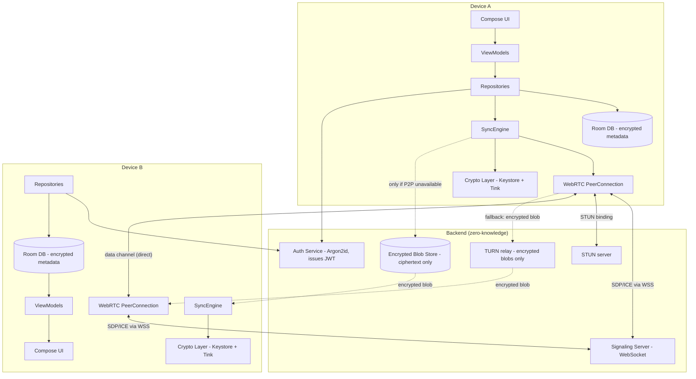

# System Architecture

## 6.1 High-level component diagram



## 6.2 Layering (per Android module, clean architecture / MVVM)

```
ui/            Compose screens + ViewModels (sealed UI state, one-way data flow)
domain/        Pure Kotlin models + use cases (no Android deps)
data/
  repository/  Single source of truth per aggregate (Auth, Folder, Media, Sync)
  local/       Room entities/DAOs — store ciphertext + non-sensitive metadata only
  remote/      Retrofit (auth/REST) + OkHttp WebSocket (signaling)
crypto/        Keystore-backed key management, Tink AEAD/hybrid encryption wrappers
sync/          SyncEngine orchestration, WebRTC peer management, WorkManager transfer worker
di/            Hilt modules wiring the above
```

Dependency rule: `ui → domain ← data`. `crypto` and `sync` are used by `data.repository` and never
imported directly by `ui`. This keeps every screen testable with fake repositories.

## 6.3 Why hybrid P2P + encrypted relay (not pure P2P)

Pure P2P requires both devices reachable at the same instant. Real users are not: phones sleep,
apps get killed by the OS, connectivity drops. The requirements themselves anticipate this
("If direct peer-to-peer connection fails, the system may use encrypted relay infrastructure").
This scaffold's `SyncEngine` therefore:

1. Always attempts a WebRTC data channel first (STUN, then TURN as an ICE candidate — not as a
   media relay you opt into separately; TURN here just relays already-DTLS-encrypted RTP/data,
   and our payload inside that channel is *additionally* AES-256-GCM encrypted per-file).
2. If no channel forms within a bounded timeout (recipient offline, symmetric NAT with TURN also
   failing), falls back to uploading the AES-256-GCM ciphertext blob to the relay's blob store,
   where it waits until the recipient's `SyncEngine` polls or receives a push wake and pulls it.
3. Either path: the server only ever sees ciphertext, encrypted folder name/thumbnail, and routing
   metadata (folder id, sender id, blob size, timestamp) — never plaintext.

## 6.4 Presence & signaling minimization

- Presence is a single boolean per user per device, held only in memory on the signaling server
  (not persisted), pushed to the folder's other participant only — never broadcast.
- Signaling messages (SDP offer/answer, ICE candidates) are opaque to the server: it relays them
  by `(fromUserId, toUserId)` without needing to parse or store their contents beyond the
  in-flight relay.
